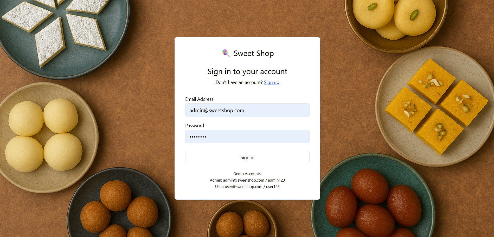
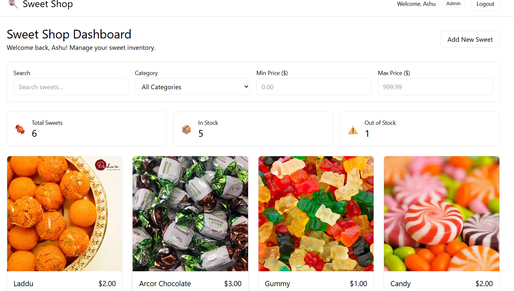
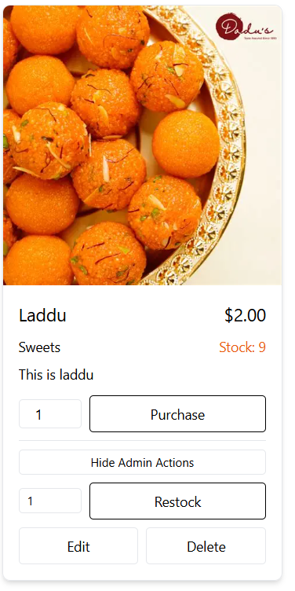

# Sweet Shop Management System - Complete Setup Guide

This project implements a full-stack Sweet Shop Management System

## Quick Start

**Demo Accounts:**
- Admin: `admin@sweetshop.com` / `admin123`
- User: `user@sweetshop.com` / `user123`

### Clone the Project and move to sweet_shop directory

```bash
git clone https://github.com/Saiashu12/Sweet_Shop_Management.git

cd sweet_shop
```

### Backend (For External Deployment)
The backend folder contains a complete Node.js/Express API that you can deploy separately:

**Navigate to backend directory:**
```bash
cd backend
```

**Install dependencies:**
```bash
npm install
```

**Run in development:**
```bash
npm run dev
```

### Now run frontend
```bash
cd frontend
```
## Install Dependencies
```bash
npm install
```
## Run the project

```bash
npm start
```

Now the project will run in localhost:3000

### My AI Usage

As per project requirements, I leveraged AI responsibly throughout development:

## Tools Used:

ChatGPT (for debugging guidance, generating boilerplate, and test examples)

GitHub Copilot (inline code suggestions, function autocompletion)

## How I Used Them:

Brainstormed API structures and test cases with ChatGPT.

Generated initial controller/service scaffolding with Copilot.

Asked ChatGPT for explanations and code review suggestions when refining logic.

## Reflection:
AI tools improved my productivity by reducing boilerplate time and helping me focus on logic and testing. However, I ensured that every AI-generated snippet was understood, reviewed, and refactored before committing. This allowed me to maintain full ownership of the project while benefiting from AI acceleration.
## API Documentation

### Authentication Endpoints

#### Register User
```http
POST /api/auth/register
Content-Type: application/json

{
  "name": "John Doe",
  "email": "john@example.com",
  "password": "password123",
  "role": "user" // optional, defaults to "user"
}
```

#### Login User
```http
POST /api/auth/login
Content-Type: application/json

{
  "email": "john@example.com",
  "password": "password123"
}
```

### Sweet Management Endpoints

All sweet endpoints require authentication. Include the JWT token in the Authorization header:
```http
Authorization: Bearer <your-jwt-token>
```

#### Get All Sweets
```http
GET /api/sweets
```

#### Search Sweets
```http
GET /api/sweets/search?q=chocolate&category=chocolate&minPrice=1&maxPrice=5&page=1&limit=10
```

#### Create Sweet (Admin Only)
```http
POST /api/sweets
Content-Type: application/json

{
  "name": "Dark Chocolate Truffle",
  "category": "chocolate",
  "price": 2.50,
  "quantity": 25,
  "description": "Rich dark chocolate truffle",
  "imageUrl": "https://example.com/image.jpg"
}
```

#### Update Sweet (Admin Only)
```http
PUT /api/sweets/:id
Content-Type: application/json

{
  "name": "Updated Sweet Name",
  "price": 3.00
}
```

#### Delete Sweet (Admin Only)
```http
DELETE /api/sweets/:id
```

#### Purchase Sweet
```http
POST /api/sweets/:id/purchase
Content-Type: application/json

{
  "quantity": 2
}
```

#### Restock Sweet (Admin Only)
```http
POST /api/sweets/:id/restock
Content-Type: application/json

{
  "quantity": 10
}
```

## 🧪 Testing the Application

### Frontend Testing (Current)
1. **Registration Flow:**
   - Try registering as both user and admin
   - Test form validation

2. **Authentication Flow:**
   - Login with demo accounts
   - Test logout functionality

3. **Customer Features:**
   - Browse and search sweets
   - Test purchase functionality
   - Try purchasing out-of-stock items

4. **Admin Features:**
   - Add new sweets
   - Edit existing sweets
   - Restock functionality
   - Delete sweets

### Screenshots

## Login Page


## Home Page


## Admin Sweet Card


## User Sweet Card

